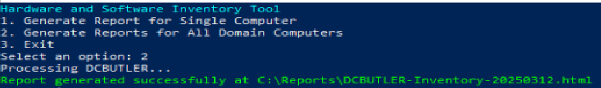
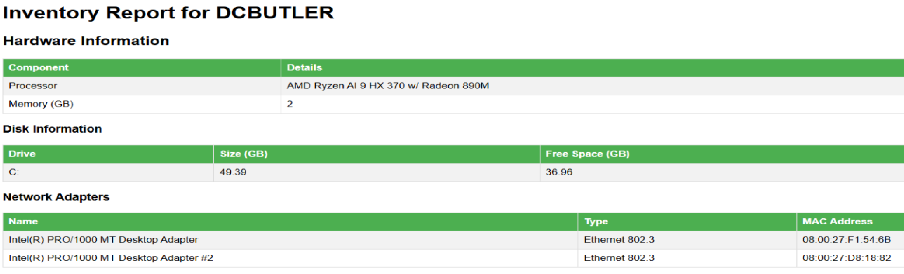
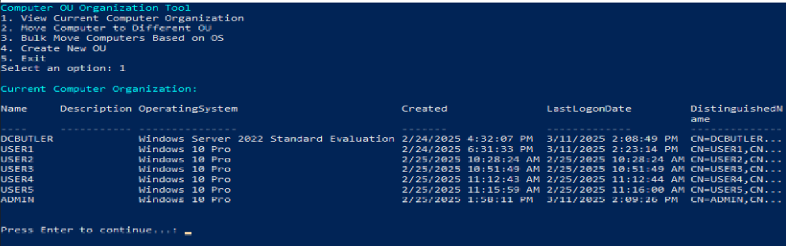
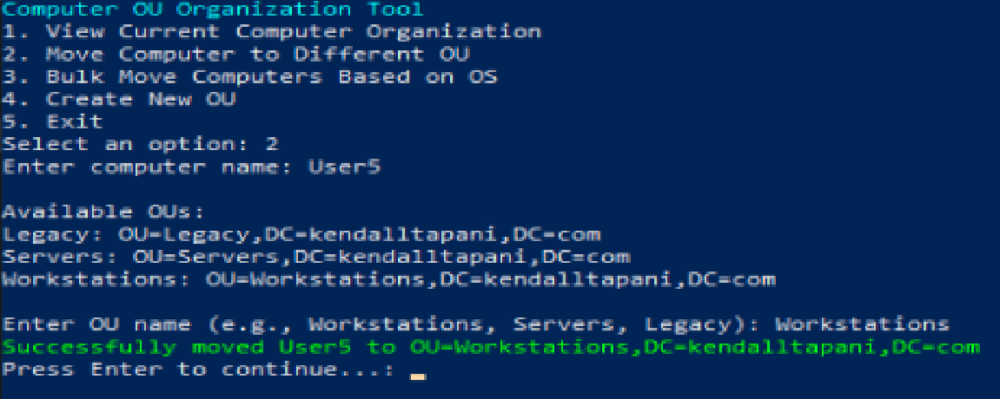
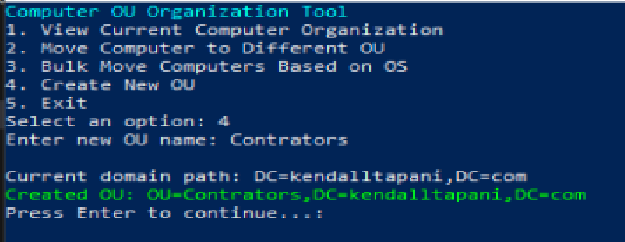

# Computer Management Scripts

A collection of PowerShell scripts for managing Active Directory computer accounts in the kendalltapani.com domain. These scripts provide automated solutions for computer inventory, organization, and maintenance tasks.

## Available Scripts

### Hardware and Software Inventory
A comprehensive inventory tool with the following features:
- Detailed hardware information collection
- Software inventory with version tracking
- HTML report generation
- Single computer or domain-wide scanning
- Network connectivity validation
- Automatic report organization

### Computer Account Organization
Manages computer account placement in Active Directory:
- Dynamic OU structure creation
- Automatic computer categorization
- Bulk computer moves
- Location-based organization
- Detailed move logging

### Stale Computer Cleanup
Identifies and manages inactive computer accounts:
- Automated stale account detection
- Configurable inactivity thresholds
- Scheduled cleanup operations
- Backup of removed accounts
- Detailed cleanup reporting

## Requirements
- PowerShell 5.1 or higher
- Active Directory PowerShell module
- Administrative permissions in your AD environment
- Windows Remote Management (WinRM) enabled for remote operations
- RSAT Tools installed for AD management 