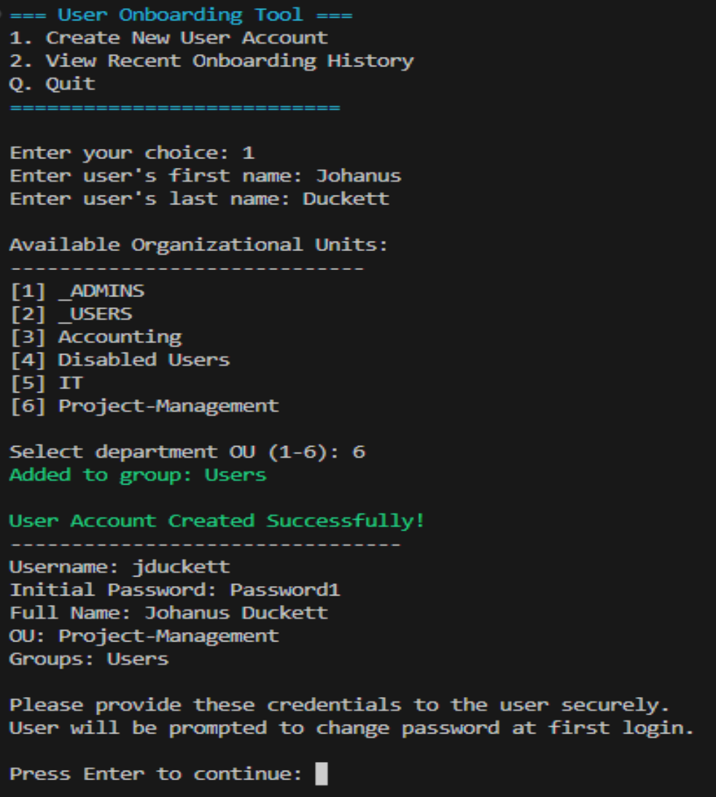
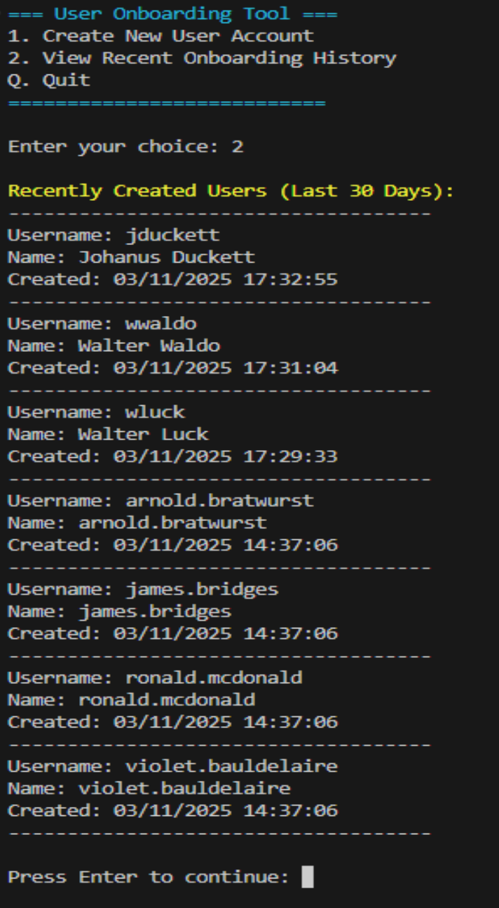
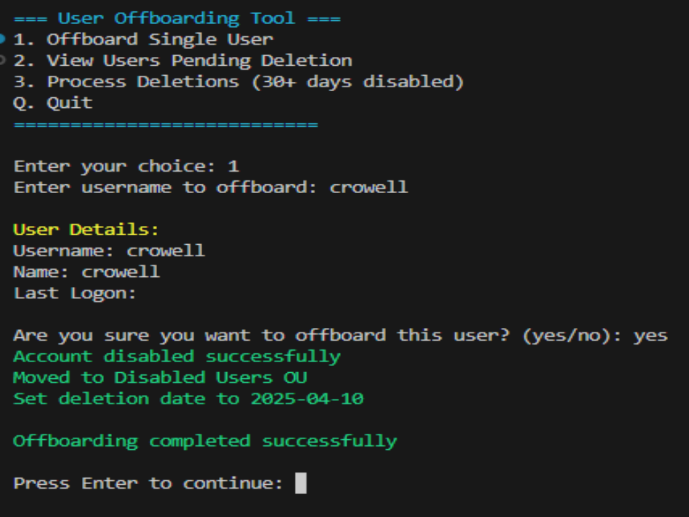
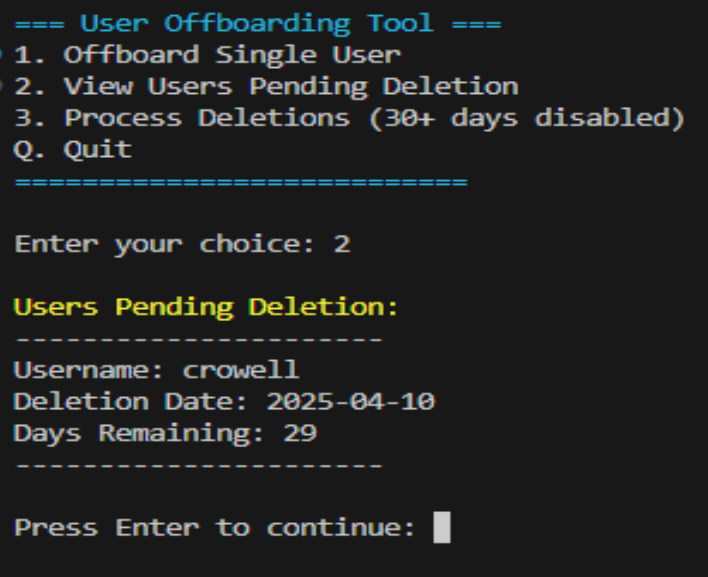
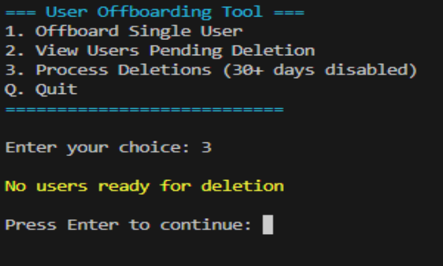

# Active Directory Scripting

A comprehensive collection of PowerShell scripts for managing and automating Active Directory tasks in the kendalltapani.com domain. These scripts are designed to streamline administrative tasks and improve efficiency in AD environments.

## Directory Structure

### User Management
Scripts for managing user accounts:
User creation and deletion, Password management, Account status monitoring, Bulk user operations, OU management

### Group Policy Management
Tools for managing AD groups and policies:
Group membership management, Security group auditing, Distribution list automation, Policy deployment and reporting

### Security and Compliance
Scripts focused on maintaining AD security:
Account lockout monitoring, Permission auditing, Security group management, Compliance reporting

### Computer Management
Tools for managing computer accounts:
Hardware/software inventory, Stale account cleanup, OU organization, System health monitoring

 
 
 

## User Management Scripts

### User Onboarding
A script for streamlined user creation in Active Directory with the following features:
- Interactive menu system
- Dynamic OU selection
- Automatic username generation (first initial + last name)
- Standard group assignments
- Hardcoded initial password with forced change at first login
- 30-day onboarding history tracking

 

### User Offboarding
Manages the secure deactivation of user accounts with features including:
- Account disablement
- Automated move to "Disabled Users" OU
- 30-day retention before deletion
- Scheduled cleanup of expired accounts
- Detailed logging of offboarding actions

  

### Account Locking/Unlocking
Manages user account states with enhanced features:
- Account locking/unlocking
- Remote computer reboot capability
- Network connectivity validation
- Detailed error handling and diagnostics

## License
This project is licensed under the MIT License - see the LICENSE file for details.

