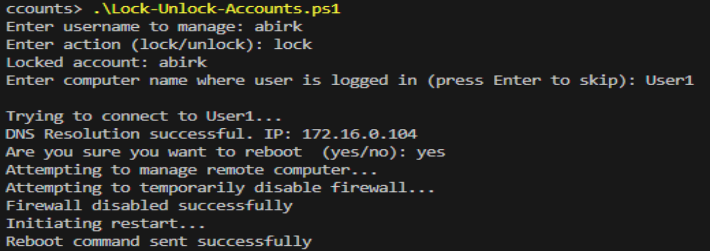

# Active Directory Scripting

A comprehensive collection of PowerShell scripts for managing and automating Active Directory tasks in the kendalltapani.com domain. These scripts are designed to streamline administrative tasks and improve efficiency in AD environments.

## Directory Structure

### User Management
Scripts for managing user accounts, including:
- User creation and deletion
- Password management
- Account status monitoring
- Bulk user operations
- OU management

### Group Policy Management
Tools for managing AD groups and policies:
- Group membership management
- Security group auditing
- Distribution list automation
- Policy deployment and reporting

### Security and Compliance
Scripts focused on maintaining AD security:
- Account lockout monitoring
- Permission auditing
- Security group management
- Compliance reporting

### Computer Management
Tools for managing computer accounts:
- Hardware/software inventory
- Stale account cleanup
- OU organization
- System health monitoring

## Requirements
- PowerShell 5.1 or higher
- Active Directory PowerShell module
- Administrative permissions in your AD environment
- Windows Remote Management (WinRM) enabled for remote operations

## User Management Scripts

### User Onboarding
Location: `User-Management/User-Onboarding/User-Onboarding.ps1`

A script for streamlined user creation in Active Directory with the following features:
- Interactive menu system
- Dynamic OU selection
- Automatic username generation (first initial + last name)
- Standard group assignments
- Hardcoded initial password with forced change at first login
- 30-day onboarding history tracking

#### Screenshots
Main Menu and User Creation:

Successful User Creation:

### User Offboarding
Location: `User-Management/User-Offboarding/User-Offboarding.ps1`

Manages the secure deactivation of user accounts with features including:
- Account disablement
- Automated move to "Disabled Users" OU
- 30-day retention before deletion
- Scheduled cleanup of expired accounts
- Detailed logging of offboarding actions

#### Screenshots
Offboarding Process:

Account Movement Confirmation:

Cleanup Operation:

### Account Locking/Unlocking
Location: `User-Management/Locking-Unlocking-Accounts/Lock-Unlock-Accounts.ps1`

Manages user account states with enhanced features:
- Account locking/unlocking
- Remote computer reboot capability
- Network connectivity validation
- Detailed error handling and diagnostics

#### Screenshot
Lock/Unlock Operation:

## Best Practices
1. Always test scripts in a non-production environment first
2. Review and customize variables before execution
3. Maintain proper documentation of any customizations
4. Follow the principle of least privilege when assigning permissions
5. Regularly backup AD before making bulk changes
6. Monitor script execution logs for troubleshooting

## Contributing
Feel free to submit issues, fork the repository, and create pull requests for any improvements.

## License
This project is licensed under the MIT License - see the LICENSE file for details.

## Usage
Each subdirectory contains specific scripts with their own documentation and usage instructions. Always test scripts in a non-production environment first and review variables before execution. 