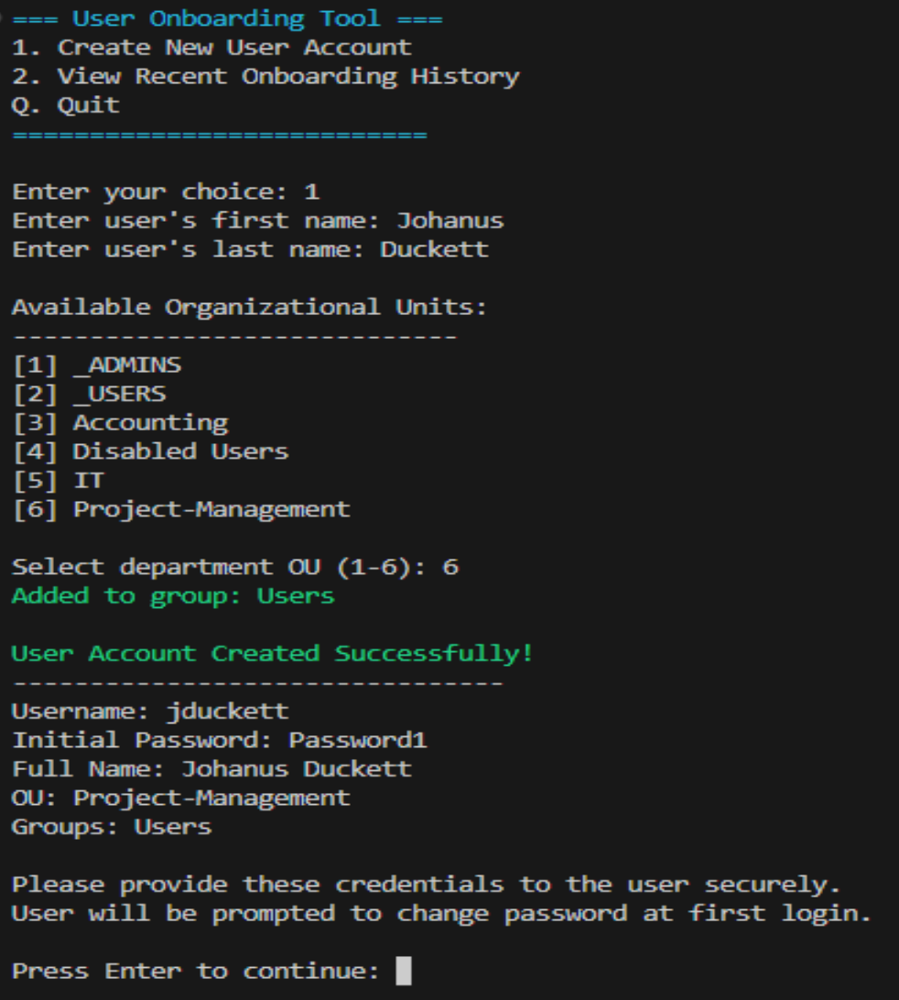
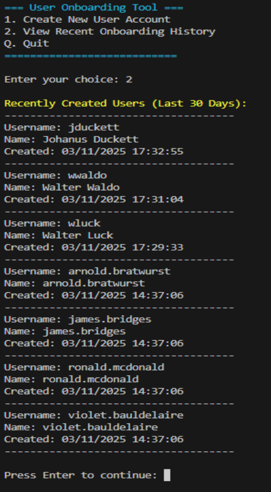
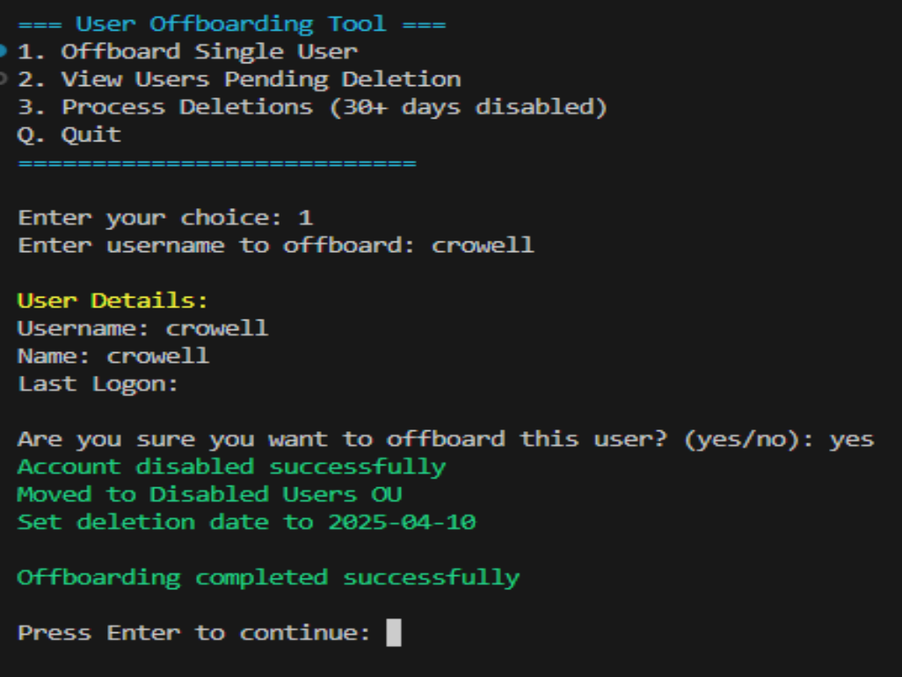

# User Management Scripts

A collection of PowerShell scripts for managing Active Directory user accounts in the kendalltapani.com domain. These scripts streamline common user management tasks and provide automated solutions for account lifecycle management.

## Available Scripts

### User Onboarding
A script for streamlined user creation in Active Directory with the following features:
- Interactive menu system
- Dynamic OU selection
- Automatic username generation (first initial + last name)
- Standard group assignments
- Hardcoded initial password with forced change at first login
- 30-day onboarding history tracking

 

### User Offboarding
Manages the secure deactivation of user accounts with features including:
- Account disablement
- Automated move to "Disabled Users" OU
- 30-day retention before deletion
- Scheduled cleanup of expired accounts
- Detailed logging of offboarding actions

  

### Account Locking/Unlocking
Manages user account states with enhanced features:
- Account locking/unlocking
- Remote computer reboot capability
- Network connectivity validation
- Detailed error handling and diagnostics

## Requirements
- PowerShell 5.1 or higher
- Active Directory PowerShell module
- Administrative permissions in your AD environment
- Windows Remote Management (WinRM) enabled for remote operations 